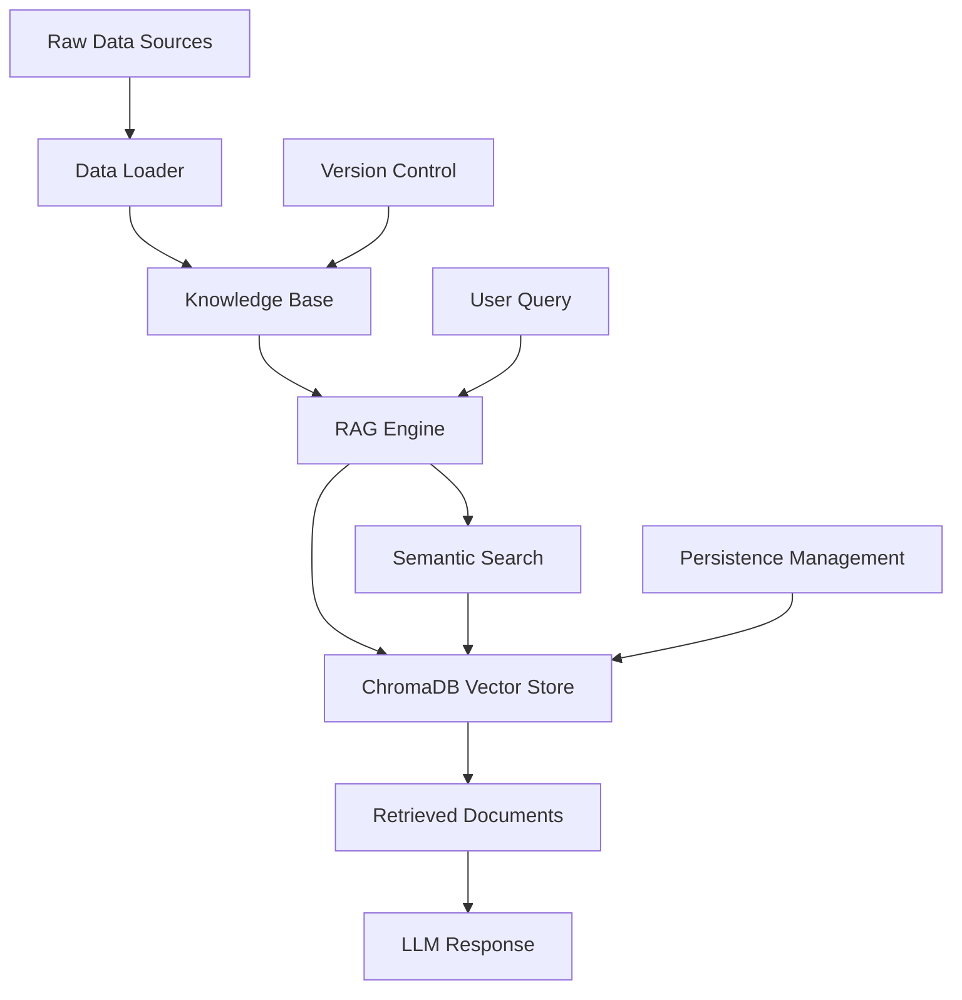

# Travel Knowledge Data Management System

This directory contains the comprehensive data management system for the travel RAG (Retrieval-Augmented Generation) engine. The system handles loading, processing, indexing, and retrieving travel knowledge from various sources.

## 🏗️ System Architecture

```
app/knowledge/
├── categories.yaml           # Knowledge category definitions
├── documents/               # Travel knowledge data files
│   ├── destinations/        # Destination guides
│   │   └── asia/           # Regional organization
│   ├── transportation/      # Transport information
│   │   └── trains/         # By transport type
│   ├── accommodation/       # Lodging information
│   ├── activities/         # Tourist activities
│   └── practical/          # Practical travel info
│       └── visa/           # Visa requirements
├── schemas/                # Data validation schemas
└── generate_travel_data.py # Data generation script
```

## 📊 Data Flow Overview



## 🚀 Key Features

### 1. **Smart Data Loading**
- ✅ Automatic file discovery and loading
- ✅ Support for JSON and YAML formats
- ✅ Schema validation and error handling
- ✅ Incremental loading with version control

### 2. **Persistent Vector Storage**
- ✅ ChromaDB with persistent storage
- ✅ Optimized vector indexing (HNSW)
- ✅ Automatic embedding generation
- ✅ Semantic search capabilities

### 3. **Version Management**
- ✅ Data change detection
- ✅ Hash-based versioning
- ✅ Smart reload decisions
- ✅ Persistence optimization

### 4. **Developer Tools**
- ✅ Interactive data generator
- ✅ Template system
- ✅ Batch processing
- ✅ Validation tools

## 📁 Data Structure

### Knowledge Item Format
```json
{
  "id": "unique_identifier",
  "title": "Human-readable title",
  "content": "Detailed content in Markdown format",
  "category": "destinations|transportation|accommodation|activities|practical",
  "subcategory": "asia|europe|trains|hotels|visa|etc",
  "location": "City, Country",
  "tags": ["tag1", "tag2", "tag3"],
  "language": "en",
  "source": {
    "name": "Source name",
    "url": "https://source-url.com",
    "reliability_score": 0.95
  },
  "last_updated": "2024-01-15T00:00:00Z"
}
```

### Category Definitions
Categories are defined in `categories.yaml`:
- **destinations**: Travel destinations and attractions
- **transportation**: Flight, train, bus, and local transport
- **accommodation**: Hotels, hostels, and lodging
- **activities**: Tours, sightseeing, and experiences
- **practical**: Visas, currency, weather, safety

## 🛠️ Getting Started

### 1. Prerequisites
Install required dependencies:
```bash
pip install chromadb sentence-transformers tiktoken pyyaml
```

### 2. Create Your First Knowledge Data

#### Option A: Use the Interactive Generator
```bash
cd app/knowledge
python generate_travel_data.py --interactive
```

#### Option B: Generate Templates
```bash
# Create a destination template
python generate_travel_data.py --template destinations --subcategory asia

# Generate all templates
python generate_travel_data.py --batch-templates
```

#### Option C: Create Sample Data
```bash
python generate_travel_data.py --sample
```

### 3. Manual File Creation
Create JSON files in the appropriate subdirectory:

```bash
# Create a new destination file
mkdir -p documents/destinations/europe
vim documents/destinations/europe/paris_guide.json
```

### 4. Initialize the Knowledge Base
```python
from app.core.knowledge_base import get_knowledge_base

# Initialize (automatically loads and indexes data)
kb = await get_knowledge_base()

# Check status
stats = kb.get_knowledge_stats()
print(f"Loaded {stats['total_knowledge_items']} knowledge items")
```

## 📋 Data Management Operations

### Loading Data
```python
from app.core.data_loader import TravelDataLoader

loader = TravelDataLoader()

# Load all data
knowledge_items = await loader.load_all_data()

# Load from specific directory
specific_items = await loader.load_from_directory(Path("documents/destinations"))

# Load single file
file_items = await loader.load_single_file(Path("documents/destinations/asia/tokyo.json"))
```

### Adding Knowledge
```python
from app.core.knowledge_base import TravelKnowledge, get_knowledge_base

# Create new knowledge item
new_knowledge = TravelKnowledge(
    id="unique_id",
    title="My Travel Guide", 
    content="Detailed travel information...",
    category="destinations",
    location="City, Country",
    tags=["travel", "guide"]
)

# Add to knowledge base (automatically indexes)
kb = await get_knowledge_base()
success = await kb.add_knowledge(new_knowledge)
```

### Searching Knowledge
```python
# Search by query
results = await kb.search_knowledge("Tokyo attractions", top_k=5)

# Search with filters
results = await kb.search_knowledge(
    "visa requirements",
    category="practical",
    location="Japan"
)
```

## 🔧 Advanced Configuration

### Vector Store Settings
The ChromaDB vector store is configured with optimized settings:
```python
# In ChromaVectorStore.__init__()
self.collection = self.client.get_or_create_collection(
    name=collection_name,
    metadata={
        "hnsw:space": "cosine",        # Cosine similarity
        "hnsw:M": 16,                  # HNSW connections
        "hnsw:ef_construction": 200,   # Build-time search
        "hnsw:ef": 100                 # Query-time search
    }
)
```

### Data Persistence
- **ChromaDB**: Stored in `./data/chroma_db/`
- **Version Info**: Stored in `./data/knowledge_version.json`
- **Automatic Detection**: System detects file changes and reloads as needed

### Embedding Model
Default model: `all-MiniLM-L6-v2` (SentenceTransformers)
- Fast inference
- Good multilingual support
- Compact embeddings (384 dimensions)

## 📊 Data Quality Guidelines

### Content Structure
1. **Title**: Clear, descriptive, location-specific
2. **Content**: Well-structured Markdown with headers
3. **Location**: Format as "City, Country" for consistency
4. **Tags**: Relevant, searchable keywords
5. **Source**: Always include reliability score

### Content Best Practices
- Use structured Markdown with headers (`##`, `###`)
- Include practical information (prices, hours, contact info)
- Provide multiple perspectives (budget/luxury options)
- Keep information current and accurate
- Use bullet points for lists and key information

### Quality Validation
The system automatically validates:
- Required fields presence
- Content length minimums
- Category validity
- Data structure compliance

## 🔍 Troubleshooting

### Common Issues

#### "No documents found"
```bash
# Check if documents directory exists and has files
ls -la app/knowledge/documents/

# Verify file format
python -m json.tool documents/destinations/asia/tokyo.json
```

#### "ChromaDB connection failed"
```bash
# Ensure directory permissions
mkdir -p ./data/chroma_db
chmod 755 ./data/chroma_db

# Check disk space
df -h
```

#### "Embedding model download failed"
```bash
# Manual download
python -c "from sentence_transformers import SentenceTransformer; SentenceTransformer('all-MiniLM-L6-v2')"
```

### Performance Optimization

#### For Large Datasets
1. **Batch Processing**: Load data in chunks
2. **Incremental Updates**: Only reload changed files
3. **Memory Management**: Monitor memory usage during indexing

#### For Fast Queries
1. **Relevant Filters**: Use category/location filters
2. **Appropriate k**: Don't retrieve too many results
3. **Cache Results**: Cache frequent queries

## 📈 Monitoring and Analytics

### Knowledge Base Statistics
```python
kb = await get_knowledge_base()
stats = kb.get_knowledge_stats()

print(f"Total items: {stats['total_knowledge_items']}")
print(f"Categories: {stats['items_by_category']}")
print(f"Languages: {stats['items_by_language']}")
print(f"Vector store: {stats['vector_store_stats']}")
```

### Data Quality Metrics
```python
loader = TravelDataLoader()
data_stats = loader.get_data_stats()

print(f"Files: {data_stats['total_files']}")
print(f"By format: {data_stats['files_by_format']}")
print(f"Total size: {data_stats['total_size']} bytes")
```

## 🔄 Data Updates and Maintenance

### Regular Updates
1. **File Monitoring**: System automatically detects file changes
2. **Version Tracking**: Hash-based change detection
3. **Incremental Loading**: Only rebuilds index when necessary

### Manual Refresh
```python
# Force reload all data
kb = await get_knowledge_base()
await kb.initialize()  # This will reload if needed

# Update specific knowledge item
await kb.update_knowledge("item_id", updated_knowledge)
```

### Backup and Recovery
```bash
# Backup knowledge data
tar -czf knowledge_backup.tar.gz app/knowledge/documents/

# Backup vector database
tar -czf vector_backup.tar.gz ./data/chroma_db/

# Restore
tar -xzf knowledge_backup.tar.gz
tar -xzf vector_backup.tar.gz
```

## 🌐 Multi-language Support

### Language Configuration
```json
{
  "language": "en",    // Primary language
  "languages": ["en", "zh", "ja"],  // Supported languages
  "content": {
    "en": "English content...",
    "zh": "中文内容...",
    "ja": "日本語コンテンツ..."
  }
}
```

### Search by Language
```python
# Search in specific language
results = await kb.search_knowledge(
    "東京の観光地",
    filter_metadata={"language": "ja"}
)
```

## 📚 Sample Data

The system comes with comprehensive sample data:

1. **Tokyo Travel Guide** (`destinations/asia/japan_tokyo.json`)
   - Complete city guide with districts, attractions, transportation
   - Budget information and cultural tips
   - Seasonal recommendations

2. **Japan Visa Guide** (`practical/visa/japan_tourist_visa.json`)
   - Detailed visa application process
   - Required documents and fees
   - Application locations and tips

3. **Shinkansen Guide** (`transportation/trains/japan_shinkansen.json`)
   - Complete bullet train system guide
   - Routes, pricing, and booking information
   - Travel tips and etiquette

## 🤝 Contributing

### Adding New Data
1. Follow the JSON schema format
2. Use the data generator for templates
3. Validate before committing
4. Include reliable sources

### Improving the System
1. Check existing issues and features
2. Follow coding standards
3. Add tests for new functionality
4. Update documentation

## 📞 Support

For questions or issues:
1. Check this README and documentation
2. Review sample data for examples
3. Use the interactive generator for guidance
4. Check logs for detailed error messages

---

**Note**: This system is designed to be developer-friendly while maintaining high data quality standards. The combination of automatic management and manual control provides flexibility for different use cases. 