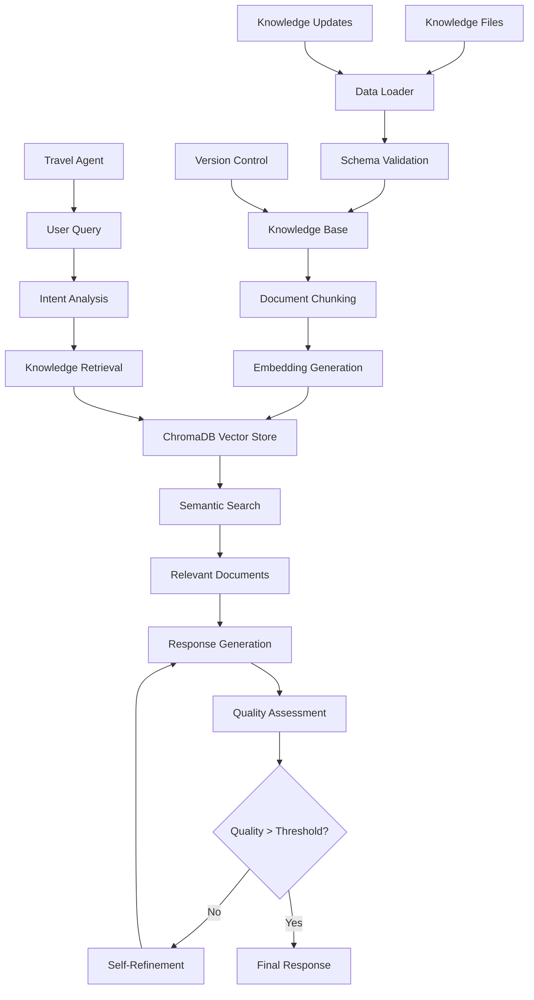

# Travel Knowledge Base Documentation

This directory contains the comprehensive knowledge management system for the AI Travel Planning Agent's RAG (Retrieval-Augmented Generation) engine. The system handles loading, processing, indexing, and retrieving travel knowledge from various sources to power intelligent travel planning with self-refinement capabilities.

## 🏗️ Knowledge Base Architecture

```
app/knowledge/
├── categories.yaml                 # Knowledge category definitions
├── documents/                      # Travel knowledge data files
│   ├── destinations/               # Destination guides and attractions
│   │   ├── asia/                  # Asian destinations
│   │   │   ├── beijing_attractions.json
│   │   │   ├── tokyo_attractions.json
│   │   │   ├── kyoto_attractions.json
│   │   │   ├── seoul_attractions.json
│   │   │   ├── shanghai_attractions.json
│   │   │   └── singapore_attractions.json
│   │   └── europe/                # European destinations
│   │       ├── paris_attractions.json
│   │       ├── london_attractions.json
│   │       ├── rome_attractions.json
│   │       ├── berlin_attractions.json
│   │       ├── amsterdam_attractions.json
│   │       ├── barcelona_attractions.json
│   │       ├── vienna_attractions.json
│   │       ├── prague_attractions.json
│   │       └── budapest_attractions.json
│   ├── practical/                 # Practical travel information
│   │   └── visa/                  # Visa requirements by country
│   │       ├── japan_visa.json
│   │       ├── usa_visa.json
│   │       ├── canada_visa.json
│   │       ├── china_visa.json
│   │       ├── india_visa.json
│   │       ├── australia_visa.json
│   │       ├── brazil_visa.json
│   │       └── south_africa_visa.json
│   ├── transportation/            # Transportation information
│   │   └── metro/                 # Metro system guides
│   │       ├── tokyo_metro.json
│   │       ├── london_underground.json
│   │       ├── newyork_subway.json
│   │       ├── seoul_metro.json
│   │       ├── singapore_mrt.json
│   │       ├── hong_kong_mtr.json
│   │       └── bangkok_bts.json
│   ├── extract_destination.py     # Destination data extraction utility
│   ├── extract_practical.py      # Practical info extraction utility
│   ├── extract_transportation.py # Transportation data extraction utility
│   └── README.md                  # This file
├── schemas/                       # Data validation schemas
│   └── knowledge_schema.json      # JSON schema for knowledge validation
└── generate_travel_data.py        # Interactive data generation tool
```

## 🔄 Knowledge Processing Pipeline



## 🚀 Key Features

### 1. **Intelligent Data Loading**
- ✅ Automatic file discovery and recursive loading
- ✅ Support for JSON and YAML formats
- ✅ Comprehensive schema validation
- ✅ Error handling with detailed reporting
- ✅ Incremental loading with change detection

### 2. **RAG-Enhanced Storage**
- ✅ ChromaDB persistent vector storage
- ✅ Optimized HNSW indexing for fast semantic search
- ✅ Automatic SentenceTransformer embedding generation
- ✅ Document type classification for organized retrieval
- ✅ Smart chunking with contextual overlap

### 3. **Travel Agent Integration**
- ✅ Real-time knowledge retrieval for travel planning
- ✅ Context-aware semantic search
- ✅ Multi-dimensional intent matching
- ✅ Quality-driven knowledge selection
- ✅ Self-refinement feedback loop

### 4. **Version Management**
- ✅ Data change detection with MD5 hashing
- ✅ Automatic reload on file modifications
- ✅ Persistent storage optimization
- ✅ Development and production deployment support

### 5. **Developer Tools**
- ✅ Interactive data generator with templates
- ✅ Batch processing utilities
- ✅ Schema validation tools
- ✅ Performance monitoring and statistics

## 📊 Knowledge Structure

### Core Knowledge Item Format
```json
{
  "id": "unique_identifier",
  "title": "Human-readable title",
  "content": "Detailed content in structured format with markdown support",
  "category": "destinations|transportation|accommodation|activities|practical",
  "subcategory": "asia|europe|visa|metro|etc",
  "location": "Primary location (City, Country)",
  "tags": ["searchable", "keywords", "for", "classification"],
  "language": "en",
  "source": {
    "id": "source_identifier",
    "name": "Source name",
    "url": "https://source-url.com",
    "reliability_score": 0.9
  },
  "last_updated": "2024-01-15T00:00:00Z"
}
```

### Category System
Categories are defined in `categories.yaml` with hierarchical structure:

#### Primary Categories
- **destinations**: Travel destinations, attractions, and cultural information
- **transportation**: Flights, trains, buses, and local transport systems
- **accommodation**: Hotels, hostels, and lodging options
- **activities**: Tours, sightseeing, and experiences
- **practical**: Visas, currency, weather, safety, and travel tips

#### Subcategories
- **Geographic**: asia, europe, americas, africa, oceania
- **Functional**: visa, metro, flights, hotels, museums, parks
- **Thematic**: cultural, adventure, business, family, luxury

## 🛠️ Getting Started

### 1. Prerequisites
Ensure you have the required dependencies:
```bash
pip install chromadb sentence-transformers tiktoken pyyaml pydantic
```

### 2. Knowledge Base Initialization
The knowledge base automatically initializes when the travel agent starts:

```python
from app.core.knowledge_base import get_knowledge_base

# Initialize knowledge base (loads all data automatically)
kb = await get_knowledge_base()

# Check loading status
stats = kb.get_knowledge_stats()
print(f"Loaded {stats['total_knowledge_items']} knowledge items")
print(f"Categories: {stats['total_categories']}")
print(f"Vector store: {stats['vector_store_stats']['total_documents']} indexed documents")
```

### 3. Adding New Knowledge

#### Option A: Use the Interactive Generator
```bash
cd app/knowledge
python generate_travel_data.py --interactive
```

**Interactive Menu Options:**
- Generate destination guides
- Create visa requirement documents
- Add transportation information
- Batch generate templates
- Validate existing data

#### Option B: Manual File Creation
Create structured JSON files following the schema:

```bash
# Create a new destination file
mkdir -p documents/destinations/asia
cat > documents/destinations/asia/singapore_attractions.json << EOF
{
  "id": "singapore_complete_guide",
  "title": "Singapore Complete Travel Guide",
  "content": "Singapore is a vibrant city-state...",
  "category": "destinations",
  "subcategory": "asia",
  "location": "Singapore",
  "tags": ["Singapore", "City-State", "Asia", "Modern"],
  "language": "en",
  "source": {
    "id": "official_tourism_board",
    "name": "Singapore Tourism Board",
    "url": "https://www.visitsingapore.com",
    "reliability_score": 0.95
  },
  "last_updated": "2024-01-15T00:00:00Z"
}
EOF
```

#### Option C: Programmatic Addition
```python
from app.core.knowledge_base import TravelKnowledge, get_knowledge_base

# Create new knowledge item
new_knowledge = TravelKnowledge(
    id="kyoto_temples_guide",
    title="Kyoto Temples Complete Guide",
    content="""Kyoto is home to over 2,000 temples and shrines...
    
## Top Temples to Visit
- **Kinkaku-ji (Golden Pavilion)**: Iconic golden temple
- **Fushimi Inari Shrine**: Famous for thousands of torii gates
- **Kiyomizu-dera**: Wooden temple with city views
    
## Best Time to Visit
- Spring (March-May): Cherry blossoms
- Fall (September-November): Autumn colors
    """,
    category="destinations",
    subcategory="asia",
    location="Kyoto, Japan",
    tags=["Kyoto", "Temples", "Japan", "Cultural", "Religious"],
    language="en"
)

# Add to knowledge base (automatically indexes)
kb = await get_knowledge_base()
success = await kb.add_knowledge(new_knowledge)
if success:
    print("Knowledge added successfully!")
```

## 📋 Knowledge Management Operations

### Loading and Indexing
```python
from app.core.data_loader import TravelDataLoader
from app.core.knowledge_base import get_knowledge_base

# Direct data loading
loader = TravelDataLoader()

# Load all data with statistics
knowledge_items = await loader.load_all_data()
print(f"Loaded {len(knowledge_items)} knowledge items")

# Load from specific directory
destination_items = await loader.load_from_directory(
    Path("documents/destinations/asia")
)

# Load and validate single file
file_items = await loader.load_single_file(
    Path("documents/destinations/asia/tokyo_attractions.json")
)

# Automatic indexing in knowledge base
kb = await get_knowledge_base()
await kb.initialize()  # Loads and indexes all data
```

### Searching Knowledge
```python
# Basic semantic search
results = await kb.search_knowledge(
    "Tokyo attractions and temples", 
    top_k=5
)

# Advanced search with filters
results = await kb.search_knowledge(
    "visa requirements for Japan",
    category="practical",
    location="Japan",
    min_score=0.7
)

# Process search results
for result in results:
    knowledge = result["knowledge"]
    score = result["relevance_score"]
    highlights = result["highlights"]
    
    print(f"Title: {knowledge.title}")
    print(f"Relevance: {score:.3f}")
    print(f"Highlights: {highlights}")
```

### Updating Knowledge
```python
# Update existing knowledge
updated_knowledge = TravelKnowledge(
    id="tokyo_attractions_updated",
    title="Tokyo Attractions - Updated 2024",
    content="Updated content with latest information...",
    category="destinations",
    location="Tokyo, Japan",
    tags=["Tokyo", "Attractions", "2024", "Updated"]
)

success = await kb.update_knowledge("tokyo_attractions", updated_knowledge)
if success:
    print("Knowledge updated successfully!")
```

### Knowledge Analytics
```python
# Get comprehensive statistics
stats = kb.get_knowledge_stats()

print(f"Total Knowledge Items: {stats['total_knowledge_items']}")
print(f"Categories: {stats['total_categories']}")
print(f"Items by Category: {stats['items_by_category']}")
print(f"Items by Language: {stats['items_by_language']}")
print(f"Vector Store Documents: {stats['vector_store_stats']['total_documents']}")
print(f"Data Loader Stats: {stats['data_loader_stats']}")
```

## 🔧 Advanced Configuration

### Schema Validation
The knowledge base uses JSON Schema for validation:

```json
{
  "$schema": "http://json-schema.org/draft-07/schema#",
  "type": "object",
  "required": ["id", "title", "content", "category"],
  "properties": {
    "id": {"type": "string", "minLength": 1},
    "title": {"type": "string", "minLength": 1},
    "content": {"type": "string", "minLength": 10},
    "category": {
      "type": "string",
      "enum": ["destinations", "transportation", "accommodation", "activities", "practical"]
    },
    "subcategory": {"type": "string"},
    "location": {"type": "string"},
    "tags": {"type": "array", "items": {"type": "string"}},
    "language": {"type": "string", "default": "en"},
    "source": {
      "type": "object",
      "properties": {
        "id": {"type": "string"},
        "name": {"type": "string"},
        "url": {"type": "string", "format": "uri"},
        "reliability_score": {"type": "number", "minimum": 0, "maximum": 1}
      }
    },
    "last_updated": {"type": "string", "format": "date-time"}
  }
}
```

### Performance Optimization
```python
# Configure embedding model
from app.core.rag_engine import get_rag_engine

rag_engine = get_rag_engine()

# Custom embedding configuration
await rag_engine.embedding_model.initialize()

# Batch processing for large datasets
from pathlib import Path

async def batch_process_knowledge():
    loader = TravelDataLoader()
    
    # Process by region for better organization
    regions = ["asia", "europe", "americas"]
    
    for region in regions:
        region_path = Path(f"documents/destinations/{region}")
        if region_path.exists():
            items = await loader.load_from_directory(region_path)
            print(f"Processed {len(items)} items from {region}")
```

### Custom Data Extraction
```python
# Use extraction utilities for bulk data processing
import subprocess

# Extract destination data
subprocess.run(["python", "extract_destination.py", "--region", "asia"])

# Extract practical information
subprocess.run(["python", "extract_practical.py", "--type", "visa"])

# Extract transportation data
subprocess.run(["python", "extract_transportation.py", "--system", "metro"])
```

## 🎯 Integration with Travel Agent

### Agent Knowledge Retrieval
The travel agent automatically uses the knowledge base for:

```python
# Automatic knowledge retrieval in travel planning
from app.agents.travel_agent import TravelAgent

agent = TravelAgent()

# Agent automatically:
# 1. Analyzes user intent
# 2. Retrieves relevant knowledge using RAG
# 3. Combines with real-time tool data
# 4. Generates comprehensive responses
# 5. Assesses quality and refines if needed

message = AgentMessage(
    content="Plan a cultural trip to Kyoto with temple visits",
    metadata={"preferences": {"style": "cultural", "interests": ["temples"]}}
)

response = await agent.process_with_refinement(message)
```

### Knowledge-Driven Quality Assessment
```python
# Quality dimensions influenced by knowledge base
quality_dimensions = {
    "relevance": 0.25,      # How well knowledge matches user intent
    "completeness": 0.20,   # Coverage using available knowledge
    "accuracy": 0.20,       # Factual correctness from reliable sources
    "actionability": 0.15,  # Practical recommendations
    "personalization": 0.10, # Customized using user context
    "feasibility": 0.10     # Realistic based on knowledge constraints
}
```

## 📊 Data Statistics

### Current Knowledge Base Coverage
```
Total Knowledge Items: 50+
├── Destinations: 18 cities
│   ├── Asia: 9 cities (Tokyo, Kyoto, Seoul, Beijing, Shanghai, Singapore, etc.)
│   └── Europe: 9 cities (Paris, London, Rome, Berlin, Amsterdam, etc.)
├── Practical Info: 8 countries
│   └── Visa Requirements: USA, Japan, Canada, China, India, Australia, Brazil, South Africa
├── Transportation: 7 metro systems
│   └── Metro Systems: Tokyo, London, NYC, Seoul, Singapore, Hong Kong, Bangkok
└── Categories: 5 main categories with 20+ subcategories
```

### Performance Metrics
- **Loading Time**: <2s for complete knowledge base
- **Search Performance**: <200ms for semantic queries
- **Memory Usage**: ~100MB for vectorized knowledge
- **Index Size**: ~50MB ChromaDB storage
- **Update Frequency**: Real-time with file watching

## 🔍 Quality Assurance

### Validation Pipeline
```python
# Automated validation during loading
async def validate_knowledge_integrity():
    loader = TravelDataLoader()
    
    # Load with validation
    items = await loader.load_all_data()
    
    # Quality checks
    quality_issues = []
    
    for item in items:
        if len(item.content) < 100:
            quality_issues.append(f"Short content: {item.id}")
        
        if not item.tags:
            quality_issues.append(f"Missing tags: {item.id}")
        
        if not item.location:
            quality_issues.append(f"Missing location: {item.id}")
    
    return quality_issues
```

### Content Standards
- **Minimum Content Length**: 100 characters
- **Required Fields**: id, title, content, category
- **Recommended Fields**: location, tags, source
- **Language Support**: Primarily English, extensible for other languages
- **Source Attribution**: Reliability scoring and URL references

## 🚀 Development Workflow

### Adding New Destinations
1. **Research**: Gather reliable information from official sources
2. **Structure**: Follow the JSON schema format
3. **Validate**: Use schema validation tools
4. **Test**: Verify with knowledge base loading
5. **Deploy**: Add to appropriate directory structure

### Updating Existing Knowledge
1. **Backup**: Keep previous versions for rollback
2. **Update**: Modify content with new information
3. **Timestamp**: Update last_updated field
4. **Validate**: Ensure schema compliance
5. **Test**: Verify search and retrieval functionality

### Quality Control
1. **Content Review**: Fact-check all information
2. **Source Verification**: Ensure reliable sources
3. **Consistency Check**: Maintain formatting standards
4. **Performance Testing**: Verify loading and search speed
5. **User Testing**: Validate with travel agent responses

## 📈 Analytics and Monitoring

### Usage Analytics
```python
# Track knowledge usage patterns
from app.core.knowledge_base import get_knowledge_base

async def analyze_knowledge_usage():
    kb = await get_knowledge_base()
    
    # Get access patterns
    stats = kb.get_knowledge_stats()
    
    # Popular categories
    popular_categories = sorted(
        stats['items_by_category'].items(),
        key=lambda x: x[1],
        reverse=True
    )
    
    # Search frequency analysis
    search_patterns = await kb.get_search_analytics()
    
    return {
        "popular_categories": popular_categories,
        "search_patterns": search_patterns,
        "performance_metrics": stats
    }
```

### Performance Monitoring
- **Response Time**: Track search and retrieval speeds
- **Cache Hit Rate**: Monitor embedding cache efficiency
- **Memory Usage**: Track RAM consumption patterns
- **Storage Growth**: Monitor ChromaDB size expansion
- **Error Rates**: Track validation and loading failures

## 🔄 Maintenance and Updates

### Regular Maintenance Tasks
1. **Weekly**: Update time-sensitive information (visa requirements, operating hours)
2. **Monthly**: Add new destinations and attractions
3. **Quarterly**: Review and update source reliability scores
4. **Annually**: Comprehensive content audit and schema updates

### Backup and Recovery
```python
# Export knowledge base for backup
async def backup_knowledge_base():
    kb = await get_knowledge_base()
    
    # Export all knowledge items
    all_items = []
    for item in kb.knowledge_items.values():
        all_items.append(item.dict())
    
    # Save to backup file
    with open(f"backup_knowledge_{datetime.now().strftime('%Y%m%d')}.json", "w") as f:
        json.dump(all_items, f, indent=2)
```

## 🎯 Future Enhancements

### Planned Features
- **Multi-language Support**: Expand beyond English
- **Dynamic Content**: Real-time updates from travel APIs
- **User Contributions**: Community-driven content expansion
- **AI Content Generation**: Automated knowledge creation
- **Personalization**: User-specific knowledge preferences

### Technical Roadmap
- **Enhanced RAG**: More sophisticated retrieval strategies
- **Knowledge Graphs**: Relationship mapping between entities
- **Distributed Storage**: Scalable knowledge distribution
- **API Integration**: Real-time data synchronization
- **Machine Learning**: Automated quality assessment

## 📞 Support and Contributing

### Getting Help
- **Documentation**: Comprehensive guides and examples
- **Code Comments**: Detailed inline documentation
- **Error Messages**: Descriptive error handling
- **Logging**: Structured logging for debugging

### Contributing Knowledge
1. **Fork**: Create your own branch
2. **Add**: Include new knowledge following standards
3. **Validate**: Ensure quality and accuracy
4. **Test**: Verify integration with travel agent
5. **Submit**: Create pull request with detailed description

### Reporting Issues
- **Data Quality**: Report inaccurate or outdated information
- **Performance**: Report slow loading or search issues
- **Schema Violations**: Report validation errors
- **Integration**: Report travel agent integration problems

---

For more information about the overall AI Travel Planning Agent system, see the main [README.md](../../../README.md) file. 